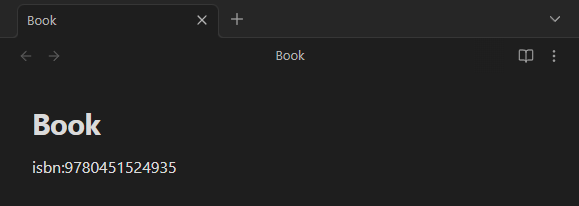

# Description

**ID**: `grab-isbn-information`\
**Minimum Obsidian Version**: `0.15.0`

Grab book information using just the ISBN!

Type `isbn:XXXXXXXXXX` or `isbn:XXXXXXXXXXXXX` (10 or 13-digit ISBN) into your note, and the plugin will fetch and insert detailed book information using the [Open Library API](https://openlibrary.org/developers/api).

Includes:

- Book Title
- Author
- Publication Date
- Publisher
- Number of Pages
- ISBN
- Cover Image

---
## Installation

Put the file on the vaults plugins directory. `vaultname\.obsidian\plugins`

```
git clone https://github.com/hawkeruh/obsidian-isbn-plugin
cd obsidian-isbn-plugin

npm install 
npm run build
npm start
```

## How to Use

1. Open a note and type something like:

   ```
   isbn:9780451524935
   ```



2. Press `Ctrl + P` and run the command:


3. Voilà! The plugin will replace the ISBN line with formatted book information and a cover image.


> The cover image will be saved automatically to the folder you configured for attachments in your Obsidian vault.

## License

[](LICENSE)
